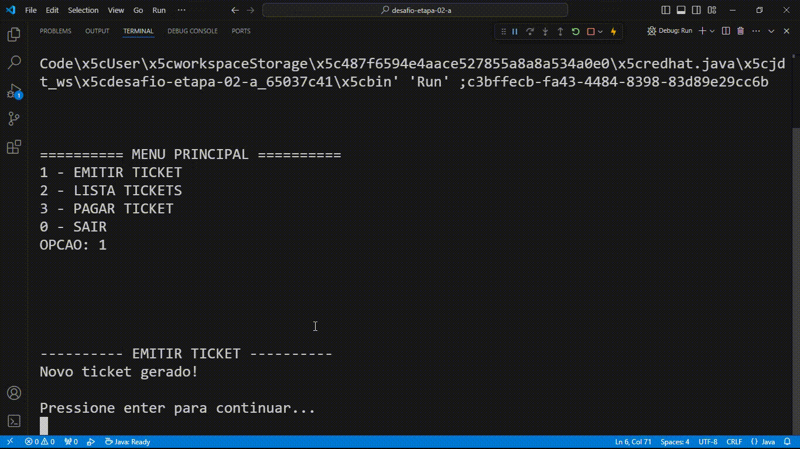

# Estacionamento

## Desafio

Desenvolver o algoritmo para uma máquina de estacionamento. Esta máquina para estacionamento deve ser capaz de:

- Emitir o ticket com um determinado valor fixo (ticket deve possuir um número e valor)
- Controlar se o ticket está pago/ou não
- Receber o pagamento do ticket
- Permitir que se possa consultar o saldo das operações a qualquer momento

## Solução

### Status de Pagamento

Um ticket pode ter dois estados de pagamento: **PAGO** ou **PENDENTE**. Para isso foi usado um `enum`, que contem os status possíveis para um ticket.

```java
public enum StatusPagamento {
    PENDENTE,
    PAGO,
}
```

### Ticket

Os tickets foram representados como uma classe. Na classe possui o **código** do ticket, que para garantir que cada ticket possua um código único, foi utilizado o `UUID`. Além disso, o ticket possui um valor, um status de pagamento e uma data e hora na qual o ticket foi emitido.

```java
public class Ticket {

    private UUID codigo = UUID.randomUUID();
    private Double valor = 4.0;
    private StatusPagamento statusPagamento = StatusPagamento.PENDENTE;
    private LocalDateTime dataHoraRegistro = LocalDateTime.now();

    // Código omitido
}
```

A classe `Ticket` ainda possui alguns métodos auxiliares para melhor manipular seus dados e mantes o bom encapsulamento. O método `pagar()` atualizada o status de pagamento do ticket para **PAGO**. Enquanto o método `isPago()` verifica se um ticket já foi pago ou não.

```java
public void pagar() {
    statusPagamento = StatusPagamento.PAGO;
}

public Boolean isPago() {
    return statusPagamento == StatusPagamento.PAGO;
}
```

### Estacionamento

A classe estacionamento é responsável por controlar os tickets gerados do estacionamento. Como atributo ela possui apenas a lista de tickets gerados. E seus métodos responsáveis por gerar novos tickets e armazená-los na lista, verificar o saldo total e o total arrecadado, ou seja, o valor total dos tickets já pagos.

```java
public class Estacionamento {

    private List<Ticket> tickets = new ArrayList<>();

    public void gerarTicket() {
        tickets.add(Ticket.emitir());
    }

    public Double saldoTotal() {
        return (tickets.stream()
            .mapToDouble(Ticket::getValor)
            .sum()
        );
    }

    public Double totalArrecadado() {
        return (tickets.stream()
            .filter(Ticket::isPago)
            .mapToDouble(Ticket::getValor)
            .sum()
        );
    }

    public List<Ticket> getTickets() {
        return tickets;
    }
}
```

Para manipular a lista de tickets foi utilizado a interface funcional do Java.

## Aplicação rodando

|  |
|-|
| *Aplicação rodando* |

## Desenvolvedor

|  |
| :-: |
| *David Gomesh* |
