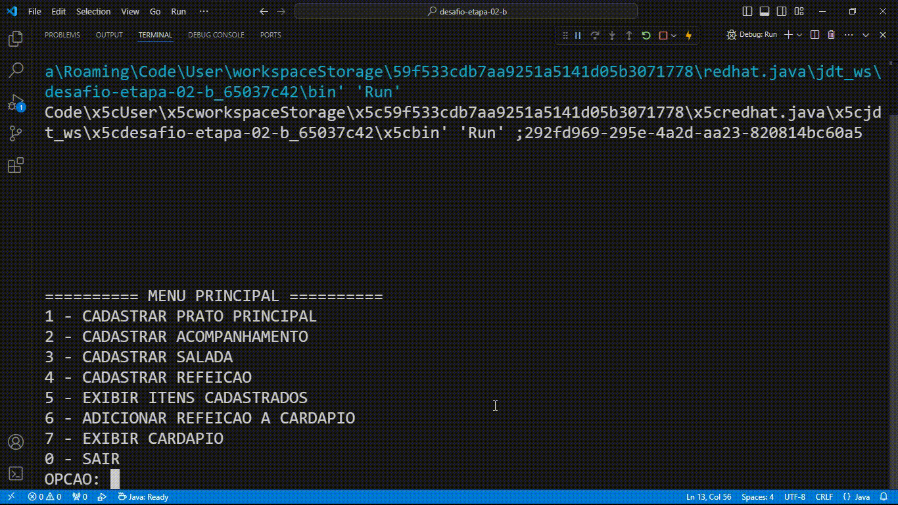

# Restaurante

## Desafio

Implemente em Java um cardápio semanal de um restaurante:

- O cardápio do RU possui para cada dia e turno, uma refeição associada. A refeição possui uma salada, um prato principal e um acompanhamento. Cada um desses três são alimentos.
- O sistema deve permitir cadastrar os alimentos.
- Em seguida associar alimentos com refeição para montar refeições.
- Com as refeições instanciadas, permitir criar o Menu que é a associação de Dia, Turno e Refeição.
- E por fim, deixar o usuário criar os Menus de cada dia da semana. No final de tudo, você deve imprimir o cardápio semanal na tela, da melhor maneira possível.

## Solução

### Alimentos

A classe `Alimento` foi criada para ser a classe mãe e garantir que todos os alimentos de uma refeição tenham uma descrição.

```java
public class Alimento {
    
    protected String descricao;

    public Alimento(String descricao) {
        this.descricao = descricao;
    }

    // Código omitido
}
```

As classes filhas de `Alimento` são as classes `PratoPrincipal`, `Acompanhamento` e `Salada`. Todas apenas extendem da classe `Alimento` e passam uma descrição em seus contrutores.

```java
public class PratoPrincipal extends Alimento {

    public PratoPrincipal(String descricao) {
        super(descricao);
    }
}
```

### Refeição

A classe `Refeicao` é responsável por juntar um prato principal, um acompanhamento e uma salada para formar uma refeição. A refeição tbm tem uma descrição que a resume.

```java
public class Refeicao {

    private String descricao;
    private PratoPrincipal pratoPrincipal;
    private Acompanhamento acompanhamento;
    private Salada salada;

    public Refeicao(String descricao, PratoPrincipal pratoPrincipal, Acompanhamento acompanhamento, Salada salada) {
        this.descricao = descricao;
        this.salada = salada;
        this.acompanhamento = acompanhamento;
        this.pratoPrincipal = pratoPrincipal;
    }

    // Código omitido
}
```

### Cardápio

É na classe `Cardapio` onde todo o controle acontece. Ela possui um `Map` que pra cada dia da semana é associado um outro `Map`, esse por sua vez associa um turno do dia a uma refeição.

```java
public class Cardapio {
    private Map<DiaSemana, Map<Turno, Refeicao>> menus = new HashMap<>();

    public void adicionarRefeicao(DiaSemana diaSemana, Turno turno, Refeicao refeicao) {
        try {
            menus.get(diaSemana).put(turno, refeicao);
        }
        catch (Exception e) {
            menus.put(diaSemana, new HashMap<>(Map.of(turno, refeicao)));
        }
    }
    
    // Código omitido
}
```

O método `adicionarRefeicao()` recebe um dia da semana, um turno e uma refeição, então faz a associação corretamente nos menus do cardápio. Para isso, ele tenta buscar o dia da semana e atualiza o mapa que associa o turno e a refeição daquele dia. Se isso não for possível, geralmente por conta do dia da semana ainda ter sido cadastrado, então o método cadastra o dia da semana e já o atribuindo a um map que associa o turno e a refeição.

## Aplicação rodando

|  |
|-|
| *Aplicação rodando* |

## Desenvolvedor

|  |
| :-: |
| *David Gomesh* |

